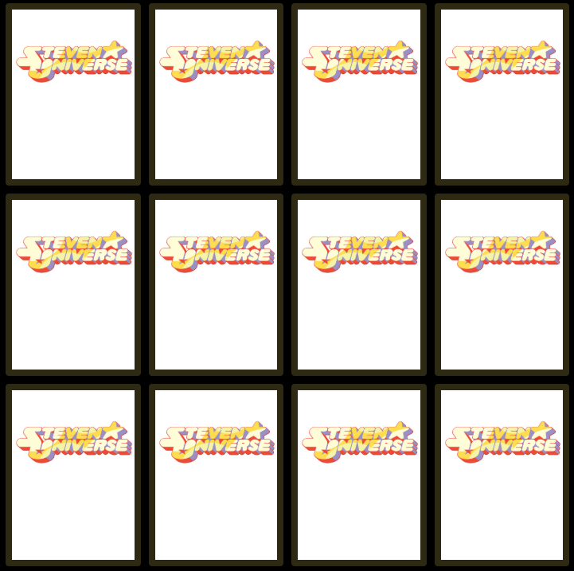

# **Memory Card Game** 🃏✨

This project is an interactive **memory card game** where players flip cards to find matching pairs. Built with vanilla JavaScript, HTML, and CSS, the game features responsive logic and smooth animations.

---
**View live game**
https://jennyglover.github.io/Memory-game/

## **Features**
- **Card Flipping**: Cards flip smoothly when clicked, revealing their content.
- **Matching Logic**: Two consecutive clicks are compared to check if the cards match.
- **Lock Mechanism**: Prevents flipping other cards while unmatched cards are flipping back.
- **Randomized Layout**: Cards are shuffled each time the game starts for replayability.
- **Dynamic Reset**: Game state resets after every match or mismatch.

---

## **Core Functionality**
### **Flip Mechanism**
- Clicking on a card flips it (`classList.add('flip')`).
- Tracks the first and second card clicks to evaluate matches.

### **Match Check**
- Compares the `data-framework` attribute of the two selected cards.
- Matches disable the flipped cards; mismatches unflip them after a short delay.

### **Shuffle**
- Cards are randomly ordered using `Math.random()` during initialization for a unique layout.

### **Reset State**
- After every match or mismatch, the game state is reset, ensuring smooth gameplay.

---

## **Technologies Used**
- **HTML/CSS**: For layout, styling, and card flip animations.
- **JavaScript**: To implement game logic and interactivity.

---

## **How to Play**
1. Click any two cards to flip them.
2. If the cards match, they remain flipped; otherwise, they flip back after a short delay.
3. The game ends when all pairs are matched!
